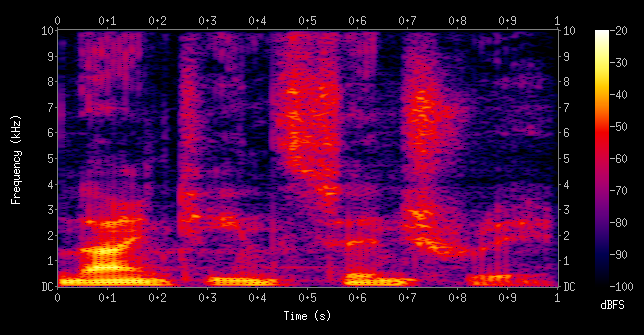
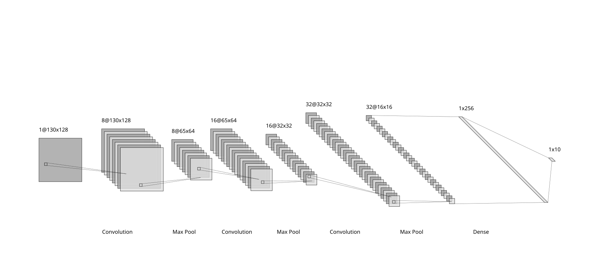

# Music Genre Classifer Model

---

## Overview

This CNN model classifies songs into one of ten genres based on the GZTAN dataset. The audio data is converted to a spectrogram, which is a visual representation of sound waves to fit with the required CNN data.

---

## Architecture

The model consists of three convolutional layers with max pooling and dropout applied after each layer. Each image is a 3 second clip of the original song spectrograms. The shape of the images are (130, 128) or (time steps per clip, mel frequency bands). 

Spectrograms are single channel becuase audio data is recorded only as amplitude of frequency, therefore final input shape is (130, 128, 1)

### Mockup (Example Architecture **CHANGE WHEN ACTUAL MODEL IS CREATED**)

---

### Hyperparaters

Insert best hyper parapeters here

**Convolutional** 
- Filter Number
- Kernel Size
- Stride 
- Padding 

**Pooling**
- Window Size

**Training**
- Learning Rate
- Batch Size
- Epochs
- Activation Functions
- Dropout Rate
- Number of Hidden/Fully Connected Layers

